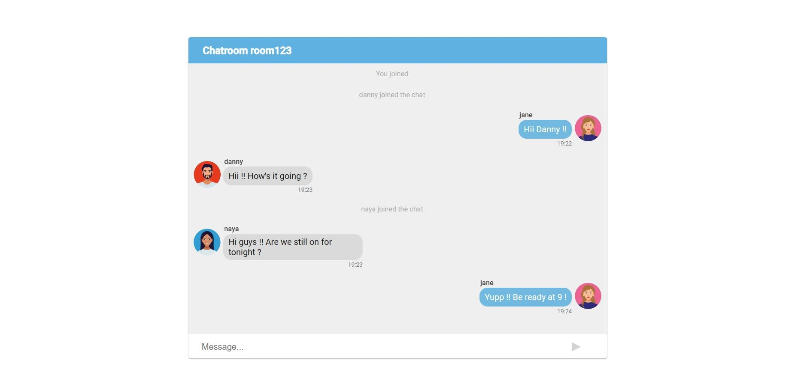
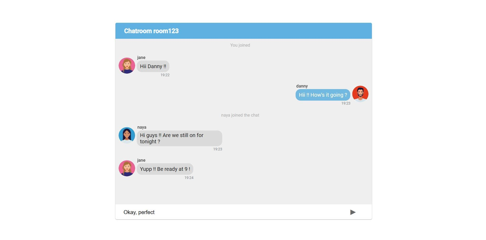

# chat-app
 Real-time chat application made with React, Node and Socket.io

# App screenshots





# Setup
Download the project and open 2 terminals. Navigate to your local repository through both terminals by running the "cd" command, e.g.

```
cd Desktop 
cd chat-app
```
Use the two terminals to navigate to both backend and frontend folders by running the following commands :
```
cd backend

cd frontend
```

Now install dependencies in both projects by running the following command in both terminals:
```
npm install
```

Finally, start both the server and the client by running the following command in both terminals:
```
npm start
```

# Requirements

Node, React


