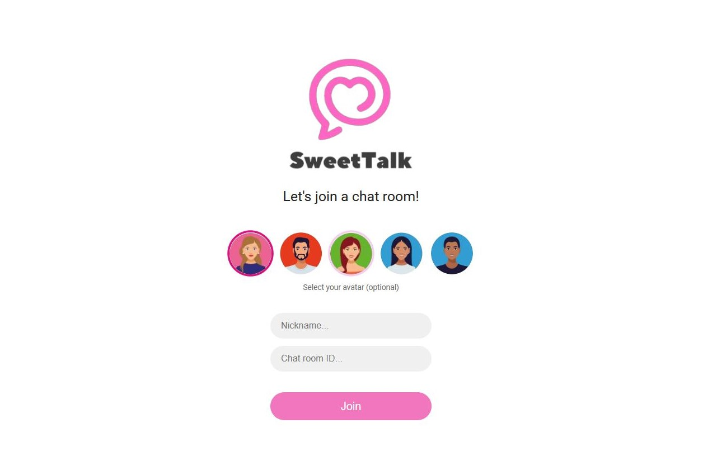
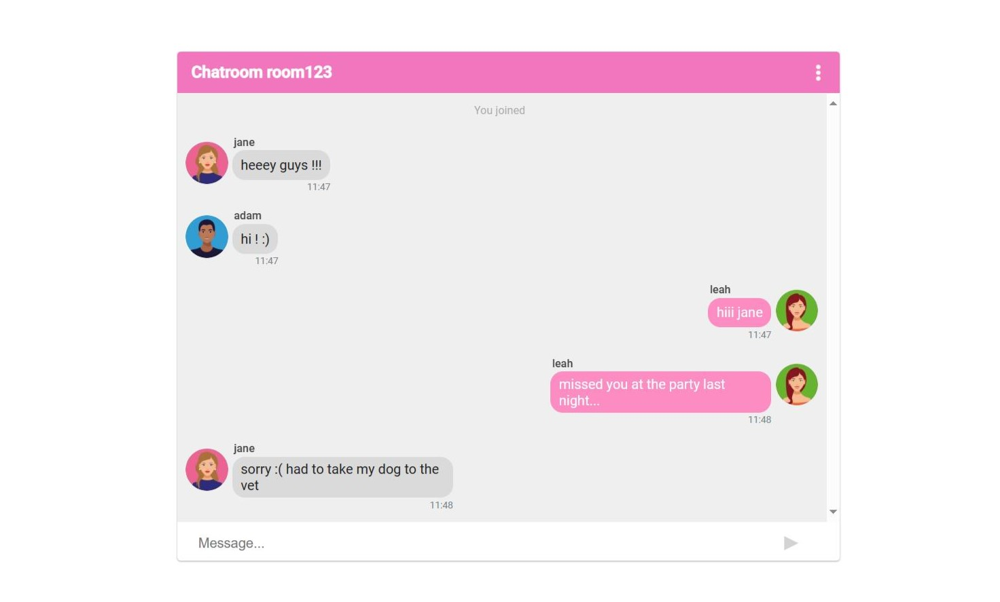
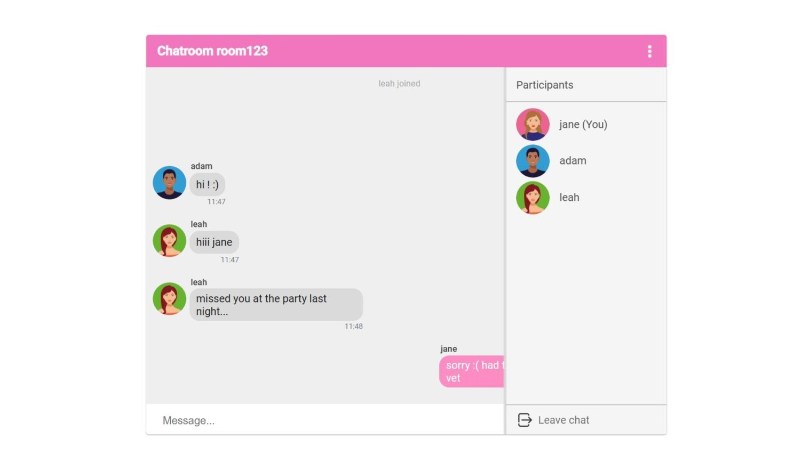

<p align="center">
  
</p>
<p align="center>
    
</p>

# 💌 SweetTalk
SweetTalk is a JavaScript real-time chat web application with a React frontend and a Node backend. Socket.io was used to implement real-time message exchange. 

Current features include:

- joining an existing chatroom via its ID
- creating a new chatroom
- sending and receiving messages in real-time
- leaving the current chat-room to join a different one

Features still in progress include:

- viewing chatroom participants
- private messaging chatroom participants
- chat background personalization

# App gallery

| | 
|:-------------------------:|
||
||
||

# 🔧 Instalation

Download the project or clone the repository by running the following command:
```
gh repo clone nkokor/SweetTalk
```

## Backend

1. Navigate to BE using the cd command, e.g.
```
cd Desktop/chat-app/backend
```

2. Install the dependencies by running:
```
npm install
```
3. Start the application using:
```
npm start
```

## Frontend

1. Navigate to FE using the cd command, e.g.
```
cd Desktop/chat-app/frontend
```

2. Install the dependencies by running:
```
npm install
```
3. Start the application using:
```
npm start
```

# ⚙ Requirements

Node, React


